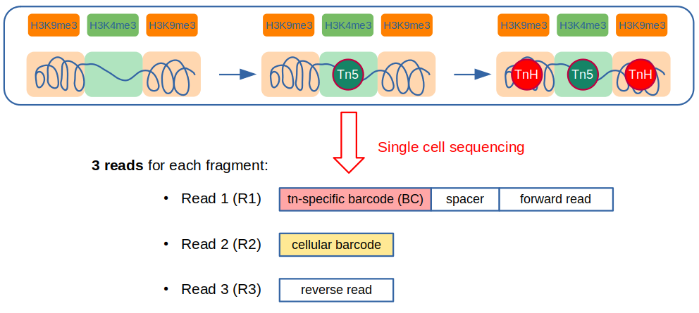
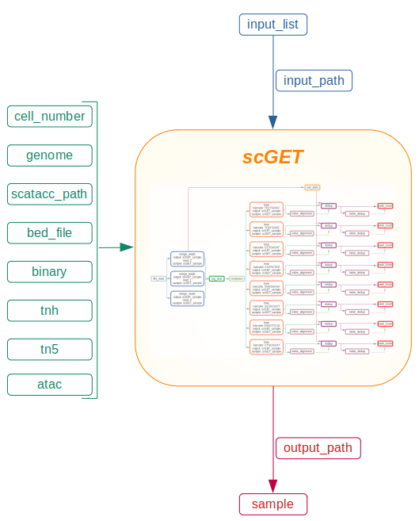

# scGET sequencing
**scGET sequencing** approach enables the analysis of both accessible and compacted chromatin, exploiting the ability of two transposases: **tn5** recognizes open chromatin, while **tnh** recognizes closed chromatin. **scGET** protocol generates 3 different reads each genomic fragment:
- read 1 (R1) represents the **forward read**
- read 2 (R2) accounts for the **cellular barcode**
- read 3 (R3) represents the **reverse read**

Once the **sequencing** protocol is finished, R1, R2 and R3 reads will be stored separately: each fragment R1 will be stored in the same file, while each fragment R2 will converge in another file, as well as each fragment R3.

From these files starts the analysis with `scGET` library.

# Configuration management
`scGET` allows the configuration of different parameters. The `config.yaml` file contains the default setting of each parameter. However, each default setting can be configured differently, directly from terminal. Here you can see a visual representation of configurable parameters needed for a personalyzed analysis.

### 1. input_list

The `input_list` must be a text file. Each line has to indicate the name of one of the fastq files. The `input_list` is accepted in two fromats:
1. *name_of_the_file* + *read_number*: read numbers are explicitly expressed for each file to each file:
> sample_S1_L001_R1_001.fastq.gz 1
> 
> sample_S1_L001_R2_001.fastq.gz 2
> 
> sample_S1_L001_R3_001.fastq.gz 3
> 
> sample_S1_L002_R1_001.fastq.gz 1
> 
> sample_S1_L002_R2_001.fastq.gz 2
> 
> sample_S1_L002_R3_001.fastq.gz 3
    

2. *name_of_the_file*: each line of the `input_list` indicates only the name of the file. A simple script will be in charge of searching for the pattern `_R1`,`_R2`, or `_R3` within each file name, in order to assign the number of read:
> sample_S1_L001_R1_001.fastq.gz 
> 
> sample_S1_L001_R2_001.fastq.gz 
> 
> sample_S1_L001_R3_001.fastq.gz 
> 
> sample_S1_L002_R1_001.fastq.gz 
> 
> sample_S1_L002_R2_001.fastq.gz 
> 
> sample_S1_L002_R3_001.fastq.gz 

### 2. input_path

The path for the input files must be expressed.

### 3. cell_number
The `cell_number` parameter accounts for the number of cellular barcodes extracted by `umi_tools`. By default `cell_number`= 5000.
### 4. genome
The path for an indexed genome is necessary for the allignment step. It may be more convenient to modify the `genome` parameter directly from the `config.yaml` file.
### 5. scatacc_path
It is necessary to clarify the path for `scatACC` directory in order to perform the deduplication step. It may be more convenient to modify the `scatacc_path` parameter directly from the `config.yaml` file.
### 6. bed_file
This parameter is mandatory for the peak count step. It may be more convenient to modify the `bed_file` parameter directly from the `config.yaml` file.
### 7. binary
If `binary`= False, it enables the selection of output counts over intervals instead of binary data. `binary`= True by default.
### 8. sample
Sample name can be clarified thanks to `sample` parameter. If sample name is not indicated, `sample` is equal to the name of the last folder of the `input_path`:

Example:

`input_path`= ${HOME}/fastq/clone12 &#8594; `sample`=clone12

While if the `input_path` is not indicated (i.e. input files are located in your current folder), `sample`= `scGET_sample` by default.

Example:

`input_path`= '' &#8594; `sample`=scGET_sample
### 9. output_path
It indicates where `scGET` results will be stored: resulting files will be stored in a folder named after the sample name.

Example:
- `output_path`= ${HOME}/results
- `sample`= scget_files

Finally, each file can be found at `${HOME}/results/scget_files` path.
