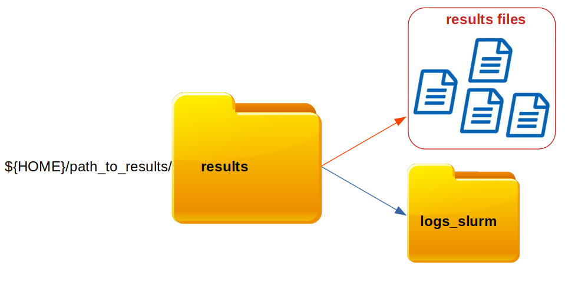

# 1. scGET
The goal of **s**ingle **c**ell **G**enome and **E**pigenome by **T**ransposases sequencing (**scGET**-seq) is to discriminate between accessible and compacted chromatin regions within each single cell. The process of discrimination of chromatin accessibility relies on two different transposases: transposase-5 binds to the accessible chromatin (**tn5**) and transposase-H, a chimeric form of tn5 (**tnH**), which recognize the compacted chromatin.


scGET architecture is built using `Snakemake`: a workflow management system, which guarantees the possibility to **parallelize** independent jobs. **scGET** workflow is described by the image below: it starts from FASTQ files generated by the sequencing platform; finally, **peak counts** are performed for both accessible and compacted regions and  two `AnnData` objects are generated (**tn5_h5ad** and **tnh_h5ad**).

 
# 2. Installing scGET
Before getting your hands dirty with scGET analyses, it is necessary to create a suitable conda **environment**. However, some packages cannot be installed, using conda. Therefore, we have designed a 4-step process, allowing an easy and quick generation of the **scget environment**.


1. The conda environment can be automatically generated, thanks to the **scget.yaml** file:
```
conda env create -f scget.yaml
conda activate scget
```
2. `TagDust` package must be installed, after the activation of the **scget environment**. First, the package must be downloaded and compiled; second, from the tagdust directory, we can copy the binary tagdust file in the scget environment: 
```
wget https://sourceforge.net/projects/tagdust/files/tagdust-2.33.tar.gz
tar -zxvf tagdust-2.33.tar.gz 
cd tagdust-2.33
./configure 
make
make check
cp ./src/tagdust $CONDA_PREFIX/bin
```
3. Similarly, also `samtools` must be installed:
   - git repositories of `samtools` and `htslib` must be cloned
   - `htslib` must be compiled and installed
   - `samtools` must be compiled and installed
```
git clone https://github.com/samtools/samtools.git
git clone https://github.com/samtools/htslib.git

cd htslib
autoreconf -i
git submodule update --init --recursive
./configure --prefix=$CONDA_PREFIX
make 
make install

cd samtools
autoheader
autoconf -Wno-syntax
./configure --prefix=$CONDA_PREFIX --without-curses
make
make install
```
4. `scatACC` repository must be cloned from github:
```
git clone https://github.com/dawe/scatACC.git
```
In order to perform the analysis through `slurm`, it may be useful to check if `screen` package is already installed:
```
screen --version
```
Output:
>Screen version 4.08.00 (GNU) 05-Feb-20


If `screen` has **not** been **installed** yet, it could be easily installed via `sudo`:
```
sudo apt update
sudo apt install screen
```

 
# 3. Slurm set up
Although `scGET` can be used locally, it is optimized to work on a cluster, managed by `Slurm` workload manager.

 - Inside ``${HOME}/.config``, you should create a series of nested direcories such that you obtain the following path `${HOME}/.config/snakemake/slurm`. Inside the **slurm folder**, you can now generate  a **config.yaml** file:
```
mkdir -p ${HOME}/.config/snakemake/slurm
cd ${HOME}/.config/snakemake/slurm
vi config.yaml
```
 - After that, you have to **compile** the config.yaml file as explained below (remember to update the queue name specified by the ``-p`` option and  your ``mail-user``):
```
jobs: 38
cluster: "sbatch --mem={resources.mem_mb} -c {resources.cpus} -o {OUTPUT_PATH}/logs_slurm/{rule}.o -e {OUTPUT_PATH}/logs_slurm/{rule}.e --mail-type=FAIL --mail-user=morelli.leonardo@hsr.it"
default-resources: [cpus=1, mem_mb=5000]
resources: [cpus=40, mem_mb=60000]
use-conda: true
```

# 4. Configuration

The path for **scatACC directory**, together with the path for the **genome** and the **bed_file** must be clarified in the `config.yaml`.


EXAMPLE:


Let's assume that the `scGET` directory is located in our home directory (`${HOME}/scGET`); while our **scatACC** directory is situated in a directory called "repositories" (`${HOME}/repositories/scatACC`); on the other hand, the **genome**  file (hg38.fa), lays in the "references" directory (`${HOME}/references/hg.38`), together with the **bed_file** (`${HOME}/references/hg385kbin.bed`):
- First, you should open the `config.yaml` file, in the `scGET` directory:
```
cd ${HOME}/scGET
vi config.yaml
```
Output:
>sample: ''
>
>reads: [1,2,3]
>
>barcodes: {'tn5':['CGTACTAG','TCCTGAGC','TCATGAGC','CCTGAGAT'],'tnh':['TAAGGCGA','GCTACGCT','AGGCTCCG','CTGCGCAT']}
>
>genome: ${HOME}/genome.fa
>
>bed_file: ${HOME}/genome.bed
>
>threads: 8
>
>cell_number: 5000
>
>scatacc_path: '${HOME}/scatACC'
>
>input_path: ''
>
>input_list: ''
>
>output_path: ''


- After that, we must modify the field `scatacc_path`, specifying our **actual scatACC path**, the field `genome`, clarifying the **genome path** with the **genome file name** and the field `bed_file` with the path for the **bed file**:


Output:
>sample: ''
>
>reads: [1,2,3]
>
>barcodes: {'tn5':['CGTACTAG','TCCTGAGC','TCATGAGC','CCTGAGAT'],'tnh':['TAAGGCGA','GCTACGCT','AGGCTCCG','CTGCGCAT']}
>
>genome: ${HOME}/**references**/**hg38.fa**
>
>bed_file: ${HOME}/**references**/**hg385kbin.bed**
>
>threads: 8
>
>cell_number: 5000
>
>scatacc_path: '${HOME}/**repositories**/scatACC'
>
>input_path: ''
>
>input_list: ''
>
>output_path: ''


**N.B. the REFERENCE GENOME must be INDEXED before the analysis**


If the genome has not been indexed yet, you can make up for this in three steps:
- Activate the **scget** conda **environment**
- Open the **directory** where the reference genome is stored
- **Index** the genome, using **samtools** library
```
conda activate scget
cd ${HOME}/references
samtools index hg38.fa
```
# 5. Input file

Two inputs are mandatory to start the scGET analisys:
- The **path** for fastq input files
- A **.txt** file, listing names of the files ready to be analyzed

EXAMPLE:

Let's assume that fastq files are stored in `${HOME}/files/samples` directory: `${HOME}/files/samples` represents the input **path**; while names of files inside `${HOME}/files/samples` directory represent the content of the **.txt** file, we must create.
```
ls ${HOME}/files/samples
```
Output:
>sample_S1_L001_R1_001.fastq.gz
>
>sample_S1_L001_R2_001.fastq.gz
>
>sample_S1_L001_R3_001.fastq.gz
>
>sample_S1_L002_R1_001.fastq.gz
>
>sample_S1_L002_R2_001.fastq.gz
>
>sample_S1_L002_R3_001.fastq.gz

From the output above, it easy to understand which **read number** corresponds to each file (R1, R2 and R3). The **.txt** file, must be characterized by the following shape:
- Each line corresponds to a file name
- Next to the file name, the **read number** should be clarified


EXAMPLE:
```
vi input_file.txt
```
After that, it must be modified as explained below:
>sample_S1_L001_R1_001.fastq.gz 1
>
>sample_S1_L001_R2_001.fastq.gz 2 
>
>sample_S1_L001_R3_001.fastq.gz 3
> 
>sample_S1_L002_R1_001.fastq.gz 1
>
>sample_S1_L002_R2_001.fastq.gz 2
>
>sample_S1_L002_R3_001.fastq.gz 3


# 6. Run
Now it's time to start the analysis! It is important to remember that the scGET analysis must be performed from the **scGET directory** or from a directory in which the Snakefile, the config.yaml and the scripts files are copied. Therefore, before starting the workflow, you should reach the **scGET directory** and activate the **scGET environment**.
```
cd ${HOME}/scGET
conda activate scget
```

In order to start with scGET analysis, you must run the following command, specifying the **input_path** and the **input_list**, generated above:
```
snakemake --cores 8 --config input_path=/home/files/experiment_test input_list=input_file.txt --profile slurm
```
# 7. Output
Once **scGET** analysis is finished results files as well as log files are generated and stored in the output directory:

- **Results files** are stored in a directory named after the sample name
- **Log files** are stored in the `logs_slurm` directory, inside the results directory


The location of results directory is indicated by the parameter `output_path`.


**N.B.**


If you need to dig more into **scGET settings**, you can find more info about scGET usage in the **advanced.md** file.
